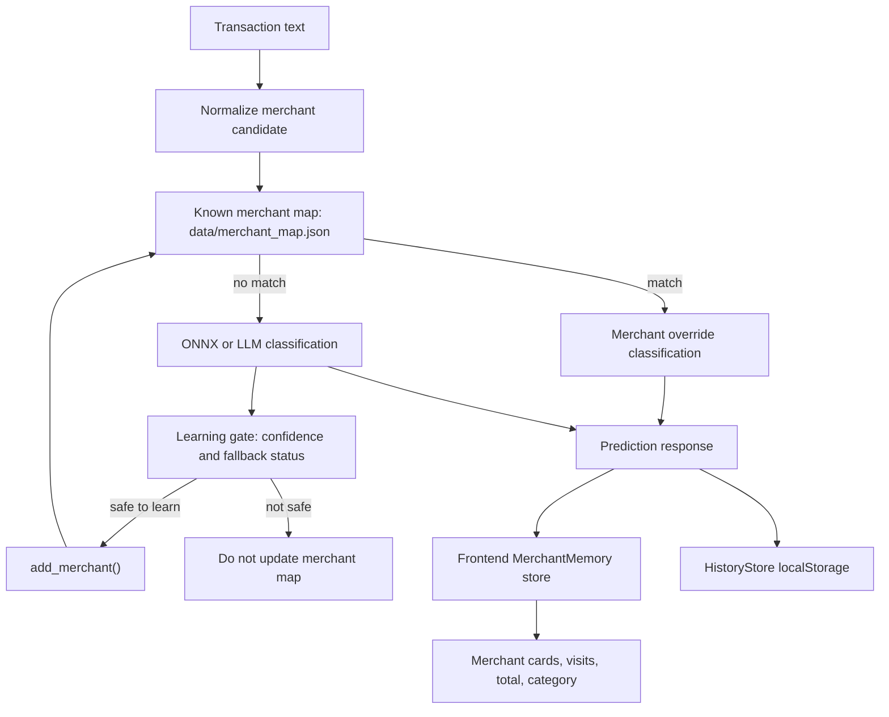

# Hybrid Categorizer Merchant Memory Diagram

Status: Known  
Portfolio readiness: Diagram file exists, but needs visual review before frontend implementation.

## Mermaid

## Source Evidence

- `docs/MERCHANT_MEMORY.md`: merchant structure, normalization, extraction examples.
- `backend/feedback.py`: `load_merchants()`, `save_merchants()`, `add_merchant()`.
- `backend/classify.py`: merchant detection, confidence-gated learning status, LLM fallback.
- `backend/main.py`: conservative `/feedback` update path.
- `frontend/src/state/MerchantMemory.js`: client-side merchant memory store.
- `frontend/src/state/HistoryStore.js`: local prediction history.

## Confidence / Assumptions

Confidence: High.

Backend memory and frontend memory are both visible in the repo. The final portfolio should clarify whether "memory" refers to the backend merchant map, frontend analytics state, or both.

## Limitation Note

Merchant memory can improve repeat transactions but can also encode wrong mappings. The portfolio should show a correction or validation path before calling it self-learning without caveats.
