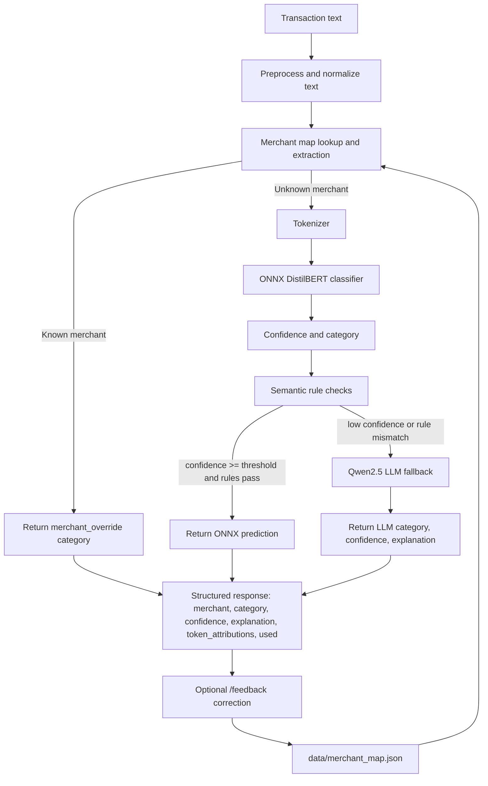

# Hybrid Categorizer Routing Diagram

Status: Known  
Portfolio readiness: Diagram file exists, but needs visual review before frontend implementation.

## Mermaid

## Source Evidence

- `docs/AI_PIPELINE.md`: merchant extraction, ONNX prediction, threshold fallback, hybrid output.
- `docs/ARCHITECTURE.md`: frontend/backend layers and response shape.
- `backend/main.py`: `/predict` and `/feedback`.
- `backend/classify.py`: `detect_merchant()`, ONNX prediction, confidence checks, semantic fallback rules, and LLM fallback.
- `data/categories.json`: `confidence_threshold`.
- `backend/feedback.py`: merchant map load/save/update.

## Confidence / Assumptions

Confidence: High.

The diagram uses documented repo components and route names. It does not include deployment infrastructure because no deployment link is currently verified for this project.

## Limitation Note

Fallback improves ambiguous cases but can add latency and depends on confidence threshold tuning. Incorrect feedback or overconfident extraction can pollute merchant memory.
