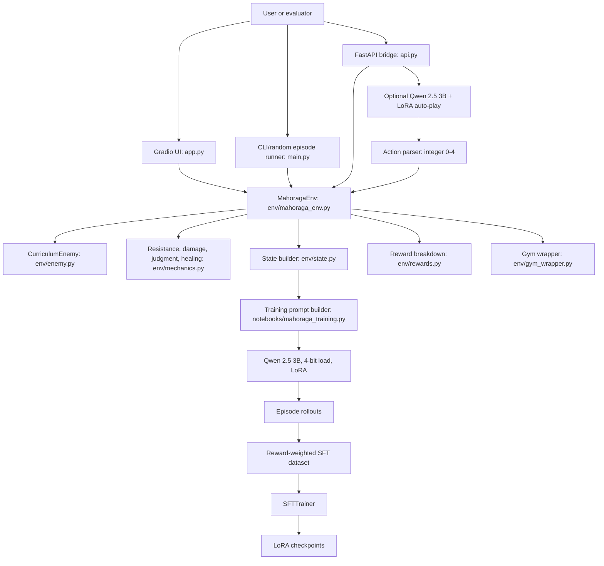

# Mahoraga Architecture Diagram

Status: Known  
Portfolio readiness: Diagram file exists, but needs visual review before frontend implementation.

## Mermaid

## Source Evidence

- `env/mahoraga_env.py`: `MahoragaEnv`, `reset()`, `step()`.
- `env/enemy.py`: `CurriculumEnemy`.
- `env/mechanics.py`: resistance, damage, judgment, heal, adaptation helpers.
- `env/rewards.py`: reward component aggregation.
- `env/gym_wrapper.py`: Gymnasium-compatible wrapper.
- `app.py`: Gradio UI path.
- `api.py`: FastAPI bridge and optional Qwen/LoRA auto-play.
- `notebooks/mahoraga_training.py`: Qwen 2.5 3B, LoRA, rollouts, reward-weighted SFT.

## Confidence / Assumptions

Confidence: Medium-High.

The environment, reward, mechanics, enemy, and training components are code-backed. The final portfolio should decide whether to present Gradio, FastAPI, or the React frontend path as the primary user-facing interface.

## Limitation Note

Do not imply production infrastructure. The documented system is an RL environment, demo UI, API bridge, and training workflow, not a deployed production service.
