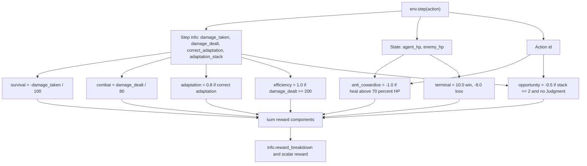

# Mahoraga Reward System Diagram

Status: Known  
Portfolio readiness: Diagram file exists, but needs visual review before frontend implementation.

## Mermaid

## Source Evidence

- `env/rewards.py` defines `compute_rewards()` and the component functions.
- `env/mahoraga_env.py` writes the returned dict into `info["reward_breakdown"]`.
- `env/mechanics.py` defines action effects that feed damage, adaptation, healing, and Judgment behavior.

## Confidence / Assumptions

Confidence: High.

This diagram follows the current `env/rewards.py` implementation, which includes an `opportunity` penalty in addition to survival, combat, adaptation, anti-cowardice, efficiency, and terminal rewards. If older docs disagree, prefer the current code.

## Limitation Note

Reward balance is a validation risk. The existence of anti-cowardice and opportunity penalties shows known exploit pressure, but it does not prove the learned policy is robust across broader enemy behaviors.
