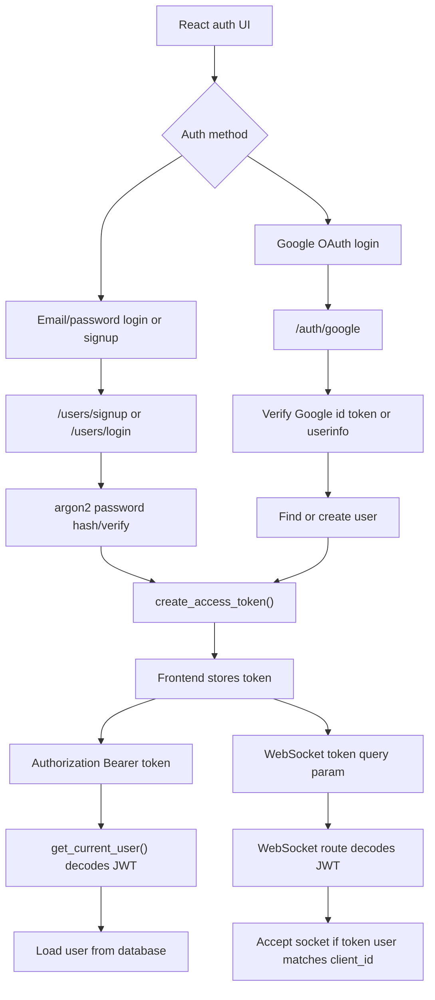

# The Loop Auth Flow Diagram

Status: Known  
Portfolio readiness: Diagram file exists, but needs visual review before frontend implementation.

## Mermaid

## Source Evidence

- `main.py`: `OAuth2PasswordBearer`, `create_access_token()`, `get_current_user()`, `/users/signup`, `/users/login`, `/auth/google`, `/ws/chat/{client_id}`.
- `src/components/LandingPage.jsx`, `LoginPage.jsx`, and `SignupPage.jsx`: frontend calls to email/password and Google auth endpoints.
- `src/hooks/useChatSystem.js`: WebSocket token query param.

## Confidence / Assumptions

Confidence: High.

The auth components are directly visible in code. The final portfolio should not imply advanced session management, refresh-token rotation, or enterprise auth hardening unless implemented and documented.

## Limitation Note

JWT expiry, token storage, and WebSocket token passing are areas to frame as practical MVP auth rather than hardened production security.
