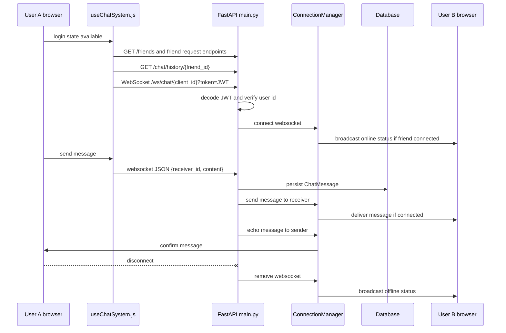

# The Loop Realtime Flow Diagram

Status: Known  
Portfolio readiness: Diagram file exists, but needs visual review before frontend implementation.

## Mermaid

## Source Evidence

- `main.py`: `/ws/chat/{client_id}`, JWT validation, `ConnectionManager`, `ChatMessage` persistence, status broadcast.
- `src/hooks/useChatSystem.js`: WebSocket creation, message send, message receive, status handling, friend data fetch.

## Confidence / Assumptions

Confidence: High.

This diagram follows the current WebSocket implementation. It does not claim automatic reconnection, delivery guarantees, or message queueing because those are not documented.

## Limitation Note

If the socket closes, the current documented flow depends on reconnect behavior in the browser session and active JWT state. Offline users do not receive realtime delivery through a queue in the documented code path.
