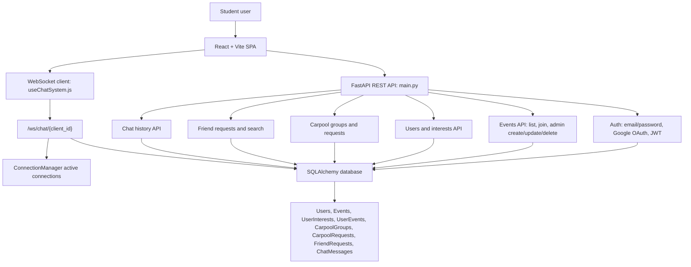

# The Loop System Diagram

Status: Known  
Portfolio readiness: Diagram file exists, but needs visual review before frontend implementation.

## Mermaid

## Source Evidence

- `README.md`: React SPA, FastAPI REST backend, event discovery, matching, friends, chat, carpool.
- `main.py`: SQLAlchemy models, REST routes, auth helpers, WebSocket route.
- `src/hooks/useChatSystem.js`: client-side friends/chat/WebSocket behavior.
- `render.yaml`: separate frontend and backend Render services.

## Confidence / Assumptions

Confidence: High for app boundaries and database model names. Medium for final deployment topology because public frontend/backend route behavior should be manually rechecked before launch copy.

## Limitation Note

Do not imply mature production operations. The repo documents app services and Render config, but not monitoring, observability, backups, or load testing.
